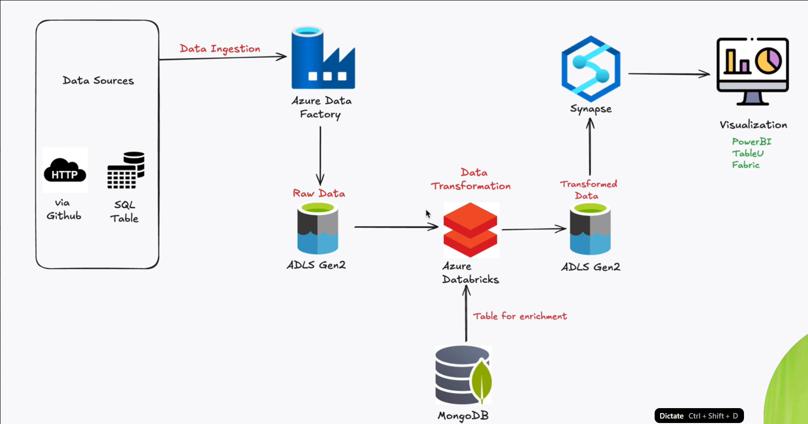

# E-commerce Data Engineering Pipeline

An end-to-end Azure data engineering pipeline built on the [Olist Brazilian E-commerce dataset](https://www.kaggle.com/datasets/olistbr/brazilian-ecommerce). This project covers the full journey from raw data ingestion through to analytics-ready SQL views, using core Azure services and a Medallion lakehouse architecture.

---

## Project Overview

The pipeline ingests e-commerce data from multiple sources (GitHub/HTTP, MySQL, MongoDB), moves it through Bronze, Silver, and Gold layers in ADLS Gen2, transforms it in Azure Databricks using PySpark, and serves it via Azure Synapse Analytics Serverless SQL Pool for reporting and BI.

**Dataset:** Olist Brazilian E-commerce — ~100,000 orders across 8 relational tables covering customers, orders, order items, products, sellers, payments, reviews, and geolocation.

---

## Architecture



*End-to-end pipeline architecture: Data sources (GitHub/HTTP and SQL Table) feed into Azure Data Factory, which lands raw data into ADLS Gen2. Azure Databricks picks up the raw data for transformation, with MongoDB used as an enrichment source. Transformed data is written back to ADLS Gen2, then queried via Azure Synapse, with final output served to visualisation tools such as Power BI, Tableau, and Microsoft Fabric.*

---

## Dataset Schema


*Olist entity relationship diagram showing how all 8 tables relate to one another. The central `olist_orders_dataset` links out to customers, order items, payments, and reviews via `order_id` and `customer_id`. Products and sellers connect through `olist_order_items_dataset`, and geolocation ties to both customers and sellers via `zip_code_prefix`.*

---

## Technology Stack

| Service | Purpose |
|---|---|
| Azure Data Factory | Pipeline orchestration and data ingestion |
| Azure Data Lake Storage Gen2 | Lakehouse storage (Bronze / Silver / Gold) |
| Azure Databricks | PySpark-based data transformation |
| Azure Synapse Analytics | Serverless SQL querying and view creation |
| MySQL | Relational source ingested via ADF |
| GitHub / HTTP | CSV source ingestion via ADF linked services |
| MongoDB | Reference and enrichment data source |

---

## Medallion Architecture

### Bronze Layer
Raw data lands here exactly as received from each source — no transformation applied. All 8 Olist CSV files are stored as-is. This layer acts as the permanent source of truth and allows full reprocessing at any time.

### Silver Layer
Databricks applies cleaning and conforming logic: handling nulls, standardising column names and data types, casting timestamps, and joining related tables where needed. Output is written as Parquet. Data at this layer is reliable and queryable, but not yet aggregated for business use.

### Gold Layer
Business-level aggregations and serving-ready datasets are produced here. This is the layer consumed by Synapse and downstream BI tools. Data lives in a `finalServing` subdirectory within the Gold container.

---

## Azure Data Factory — Ingestion

ADF orchestrates ingestion from three source types using five configured linked services:

| Linked Service | Type | Role |
|---|---|---|
| `ADLSForCSV` | ADLS Gen2 | Sink for CSV files |
| `httpGithubLinkedService` | HTTP | Pull CSVs from GitHub |
| `JSONForGithubForLoop` | HTTP | Loop through JSON config for GitHub sources |
| `filesSqlDB` | MySQL | Read from SQL source |
| `SQLToADLSLinkedService` | ADLS Gen2 | Sink for SQL-sourced data |

The main pipeline uses a **Lookup → ForEach → Copy** pattern to dynamically loop through all CSV source tables and land them in the Bronze layer, followed by a separate Copy activity for SQL ingestion.

### ADF Linked Services


*The five linked services configured in ADF: two ADLS Gen2 sinks (`ADLSForCSV` and `SQLToADLSLinkedService`), one MySQL source (`filesSqlDB`), and two HTTP sources (`httpGithubLinkedService` and `JSONForGithubForLoop`) for pulling data from GitHub.*

### ADF Pipeline


*The data ingestion pipeline showing a Lookup activity feeding into a ForEach loop for CSV sources, followed by a separate `DataFromSQL` Copy activity for MySQL ingestion. The pipeline output panel shows all 10 activities completed with a status of Succeeded, running on AutoResolveIntegrationRuntime in the Australia Southeast region.*

---

## ADLS Gen2 — Storage Layers

### Container Overview


*The `olistdata` ADLS Gen2 container showing the three top-level directories — `bronze`, `gold`, and `silver` — each representing a layer of the Medallion architecture.*

### Bronze Layer


*The Bronze layer (`olistdata > bronze`) containing all 8 raw Olist CSV files landed directly by ADF: customers (8.62 MiB), geolocation (58.44 MiB), order items (14.72 MiB), order payments (6.28 MiB), order reviews (13.78 MiB), orders (16.84 MiB), products (2.27 MiB), and sellers (170.61 KiB). No transformation has been applied.*

### Silver Layer


*The Silver layer (`olistdata > silver`) after Databricks transformation, storing cleaned and conformed data as 4 Parquet part files totalling approximately 39 GiB. The presence of `_SUCCESS` and commit metadata files confirms a successful Spark write operation.*

### Gold Layer


*The Gold layer's `finalServing` directory (`olistdata > gold > finalServing`) containing 65 items — the aggregated, analytics-ready Parquet output written by Databricks and queried by Azure Synapse via OPENROWSET.*

---

## Azure Synapse — Serverless SQL Pool

Synapse Serverless SQL Pool is used to query the Gold layer Parquet files directly using `OPENROWSET`, without loading data into a dedicated pool. SQL Views are created on top of these queries to provide a clean, stable interface for BI tools.

```sql
-- Query Gold layer Parquet using OPENROWSET
SELECT *
FROM OPENROWSET(
    BULK 'https://<your-storage>.dfs.core.windows.net/olistdata/gold/finalServing/',
    FORMAT = 'PARQUET'
) AS result
```

This approach avoids the cost of a dedicated SQL pool while still enabling standard SQL access for reporting.

---

## Repository Structure

```
├── ADF managed services.png                  # ADF linked services configuration
├── Architecture1.png                         # Full pipeline architecture diagram
├── Azure Data Factory Pipeline.png           # ADF pipeline canvas and run output
├── bronze layer.png                          # ADLS Gen2 Bronze container contents
├── dw.png                                    # Olist dataset entity relationship diagram
├── gold layer.png                            # ADLS Gen2 Gold layer finalServing contents
├── olistdata container.png                   # ADLS Gen2 top-level container structure
├── silver layer.png                          # ADLS Gen2 Silver layer Parquet output
├── Create View.sql                           # Synapse SQL to create views over Gold layer
├── DataIngestionToSQL.ipynb                  # Notebook for ingesting data into SQL
├── Databricks code for transformation.ipynb  # PySpark transformation logic
├── SQL on OlistData.sql                      # Exploratory SQL queries on Olist data
├── SQL to gold layer.sql                     # SQL used to write data to Gold layer
└── View Final 2.sql                          # Final view definitions for BI consumption
```

---

## Key Skills Demonstrated

- Designing and building a cloud-based Medallion lakehouse architecture on Azure
- Orchestrating multi-source data ingestion with Azure Data Factory (HTTP, SQL, MongoDB)
- Writing PySpark transformation logic in Azure Databricks
- Managing hierarchical lakehouse storage in ADLS Gen2
- Querying Parquet files using Synapse Serverless SQL with `OPENROWSET`
- Creating reusable SQL Views for analytics and BI consumption

---

## Dataset

[Olist Brazilian E-commerce Public Dataset — Kaggle](https://www.kaggle.com/datasets/olistbr/brazilian-ecommerce)
